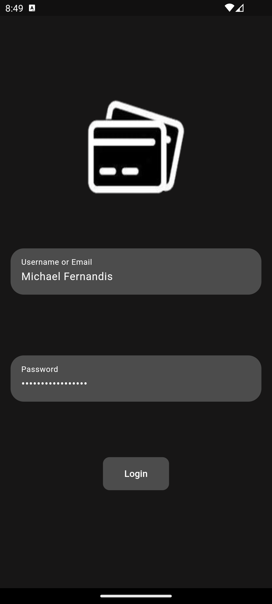
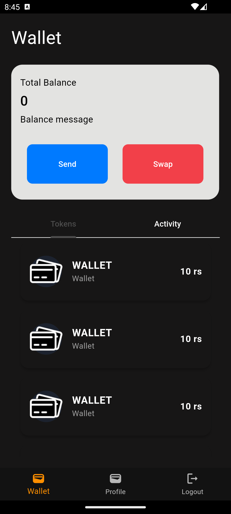
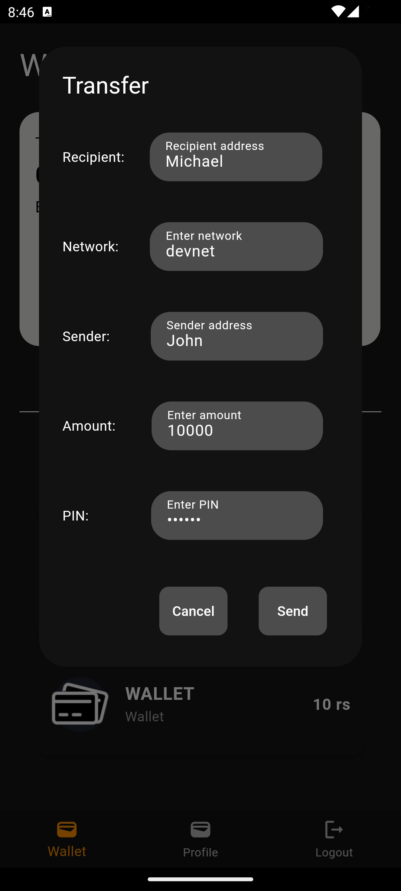
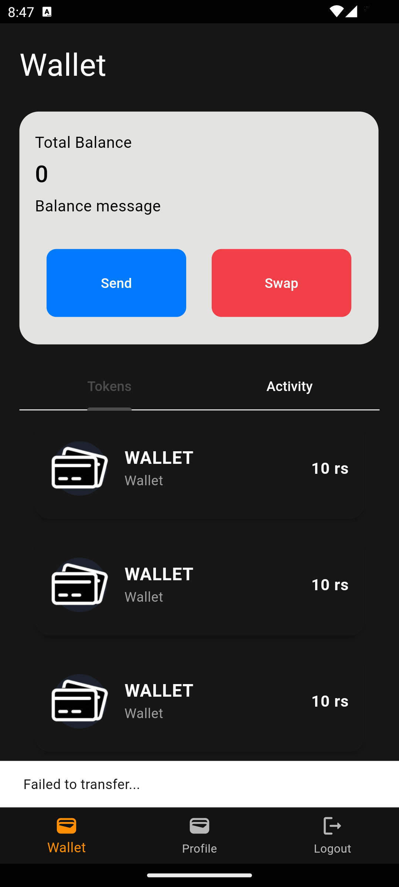
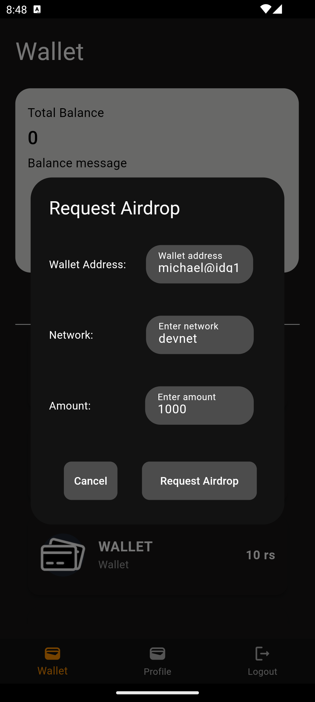
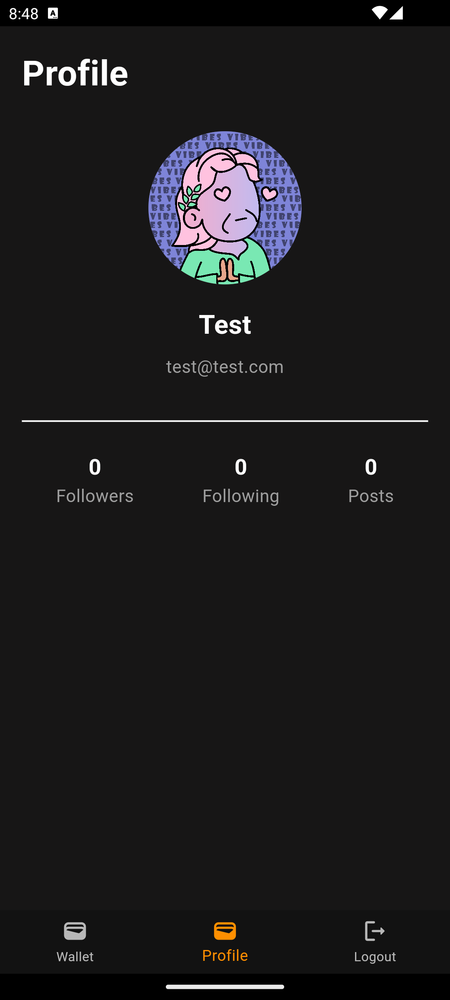

# Flutter Wallet App

This is a Flutter Wallet App assignment project for a Flutter internship. The app provides wallet functionalities such as balance display, send/swap buttons, and tabs for tokens and activity.

## Features

- User login and profile management
- Wallet balance display
- Create wallet functionality
- Transfer balance functionality
- Airdrop feature
- Wallet activity tabs

## Screenshots

### Login Screen:                                                                      
,

 ### Home Screen:


 ### Transfer Screen:


 ### Transfer Failed:


 ### Request Airdrop:


### Profile Screen:


### Logout Screen:


## Installation

1. Clone the repository:
   ```bash
   (https://github.com/Abhay-Prabhu/wallet-app)

2. Navigate to the project directory:
   ```bash
   cd flutter-wallet-app

3. Install dependencies:
   ```bash
   flutter pub get

4. Run the app:
   ```bash
   flutter run

Follow the on-screen instructions to launch the app on your preferred device or emulator.

## Contributing
If you would like to contribute to this project, please fork the repository and submit a pull request with your changes.
